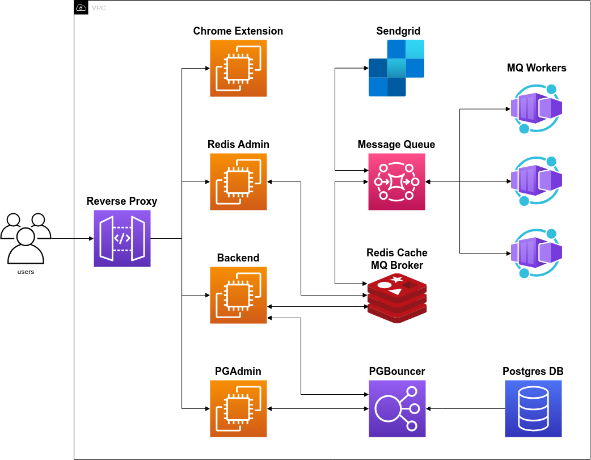

# Self Hosting

This guide will help you get started with self-hosting Vaultexe for free!

## Requirements

- Linux Server
- Docker Compose

## Cloud Architecture



## Setup

### 1. Clone the Vaultexe services

Clone Vaultexe super repo, which contains settings and docker compose configurations for all the services.

> To minimize the download size, clone the repo with `--depth 1` flag to exclude the git history.

> Remove the `docker-compose.override.yml` file as it is not needed for self-hosting in production.

```bash
git clone --depth 1 git@github.com:Vaultexe/vaultexe.git && \
    rm docker-compose.override.yml
```

### 2. Configure the services deployment settings

Inside the super-repo, you will find a `.env.example` file which contains the default settings for the services.

Copy the `.env.example` file to `.env` and update the settings as per your requirements. Some of these settings include **Domains**, **Services Passwords**, **Ports**, ets.

```bash
cd vaultexe && \
 cp .env.example .env && \
 nano .env
```

### 3. Clone all other services

In this step, we clone all other vaultexe repositories including backend, docs, diagrams, etc. While you might not need them all, it is good to review them yourself and even edit them to suit your needs.

```bash
bash scripts/clone-repos.sh
```

### 4. Configure backend service deployment settings

Inside the server repo, you will find a `.env.example` file which contains the default settings for the backend service.

Copy the `.env.example` file to `.env` and update the settings as per your requirements. Some of these settings include **Authentication Keys**, **Sendgrid Key**, **Super Admin Email**, etc.

```bash
cd server && \
 cp .env.example .env && \
 nano .env
```

### 5. Deploy

Now that you have configured all the services, you can deploy them using docker-compose 🥳.

> Make sure you are in the root directory of the super-repo `vaultexe`.

```bash
bash run.prod.sh
```

## What's Next?

Now that you have hosted Vaultexe cloud architecture on your servers, you should recieve a registration email to your `vaultexe super admin email` environment setting that you set in the backend service `.env` file.

> Important: As mentioned in the [Web Extension Section](/web-extension)
> Make sure you have set your server's IP address as the base address inside Vaultexe Web Extension settings.
> If not, the web extension will hit localhost by default.
