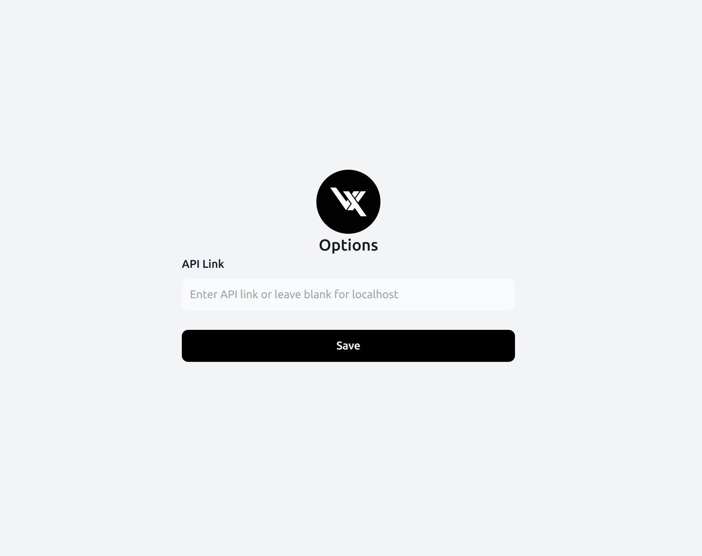

# Vaultexe Web Extension

Vaultexe web extension is free and public for all! Host your Vaultexe cloud and enjoy the benefits of the web extension

## Setup

Inorder to start using Vaultexe chrome extension, you need to configure the extension with your Vaultexe Domain/IP.
This step is crucial as the extension is only configured to work on localhost by default.

### 1. Install Vaultexe Web Extension (Beta)

### 2. Configure the extension

### 3. Enter your Vaultexe Domain/IP

## What's Next?

Now that you have configured Vaultexe Chrome Extension, you can view how to self host Vaultexe cloud in the next section and register your first super admin account.
